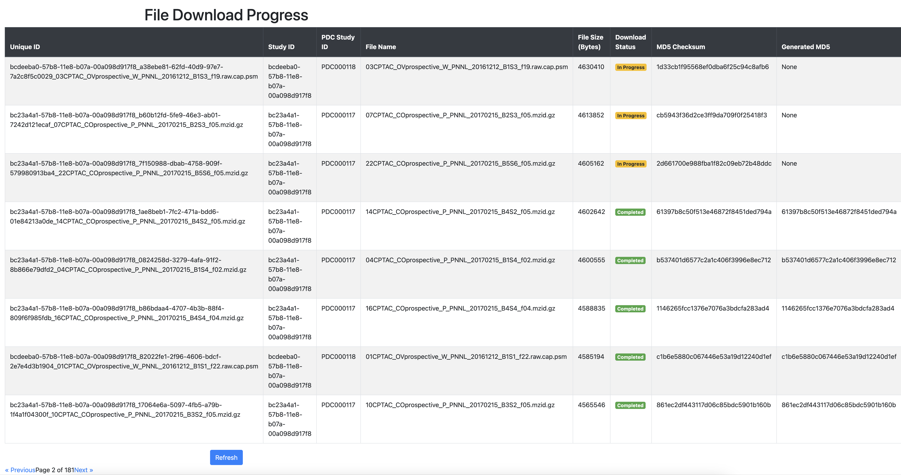
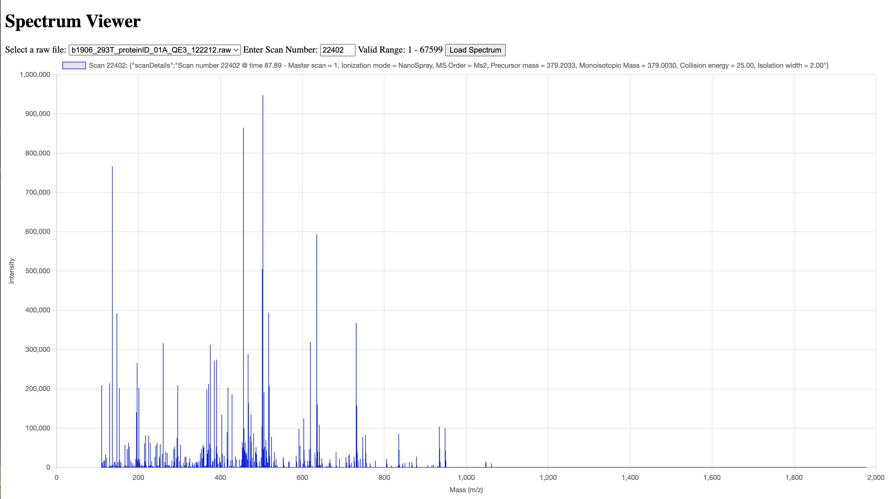

# Proteomics Data Processing Pipeline Project

## CPTAC file downloader
This Python-based application accesses CPTAC data available on Proteomic Data Commons (PDC) data repository to fetch project and study information as well as download URL via their GraphQL API (https://proteomic.datacommons.cancer.gov/pdc/api-documentation). It creates a SQLite database for this metadata information. Users of this API can query the DB to retrieve file names based on file size (e.g. smallest, largest, or in size range). Users can also start file downloading in parallel threads and monitor file downloading progress on HTML webpage. Overall this project code provides a way to download files from CPTAC programmatically via their API and store file metadata information in a database for future query. 

### System Diagram

### Individual Script Descriptions

#### fetch_study_files.py
This Python script interacts with a GraphQL API (specifically from the PDC Cancer Data Commons) to retrieve and process study and file data.
1. **Fetching Study Catalog Data:** this fetch function sends a GraphQL query to API endpoint to retrieve studies with version numbers. 
2. **Extracting Study IDs:** from study catalog, iterates over each study and its versions, extracts all study IDs from each version and compiles into a list.
3. **Fetching File Information:** for each study ID in the list, the script sends GraphQL query to retrieve file-related details such as file ID, file name, file size, MD5 checksum and a signed URL.
4. **Sorting and Saving Data:** collected file data is sorted by file size in ascending order, and written to a CSV file (all_files_sorted.csv) for downstream use. 

#### create_DB_sqlite3.py
This Python script reads file metadata stored in a CSV file and imports that data into a SQLite database.
1. **Create SQLite Database** called file_metadata_database.db
2. **Create a table to store CSV data:** defined SQL schema:
   - file_id (primary key)
   - file_name
   - file_size
   - md5sum
   - signedURL
3. **Read and import CSV data:** opens all_files_sorted.csv and read row by row into SQL table (replace existing entries with new data if same primary key)
4. **Save changes and close database connection**

#### API_get_files.py
This code provides a web service using Flask framework that interacts with a SQLite database and integrates Prometheus for monitoring HTTP request metrics. 
1. **Prometheus Metrics Setup:**
   - request_count (counter)
   - request_latency (histogram)
   - request_errors (counter)
2. **Request Timing Middleware:** record time before and after request
3. **Prometheus Metrics Endpoint**
4. **SQLite Database Query Functions**
   - get_smallest_files
   - get_largest_files
   - get_files_in_size_range(min_size, max_size)
5. **API endpoints:**
   - /smallest_files, GET method
   - /largest_files, GET method
   - /files-in-range, GET method

#### download_files_with_progress_DB.py
This is a Python application that downloads files from GraphQL API, records download progress in SQLite Database, and provides a simple web interface for monitoring that progress. 
1. **SQLite Database Setup and Management**
2. **API Interaction:**
     - fetch study information
     - fetch files for each study
3. **File Download and Processing:**
    - Checks the database to see if file has already been downloaded
    - Extract download URL and call API to download
    - Logs the file as in_progress and attempts to download
    - Once successful (HTTP 200) it saves downloaded content into a file with unique identifier, and updates download record in database and verifies checksum and finally marks status as completed.
    - If download fails it updates record as failed.

      
#### index.html
This HTML displays a file download progress report in table format. 
Status column is dynamically rendered and color coded based on conditions: completed in green, in_progress in yellow, Failed in red. 
#### Example webpage display

## Spectrum Viewer Project
This application lets users choose from a list of dropdown raw files and a list of scans for each file to view spectrum for that scan in HTML webpage. The program was written in C# with REST API endpoints. It uses ThermoFisher's raw file reader library to open mass spectrometry raw data, get scan information, and display spectrum data points in a 2D plot. This allows scientist to visualize speectral data for further analysis, such as peak picking or identification of peaks. 

### System Diagram

### Individual Script Descriptions
#### MyAPI.csproj
This XML script describes .NET configuration and specifies external NuGet package dependencies. 

#### Program.cs
This C# program uses ASP.NET Core to create a simple web service that serves both static web pages and API endpoints for interacting with RAW files (commonly used in mass spectrometry data analysis).

**HTTP Endpoints**
- root endpoint
- file servering endpoint
- API endpoint to list RAW files
- API endpoint for Scan Range
- API endpoint for Scan Details
- API endpoint for Spectrum Data

#### RawFileReader.cs
This C# code creates a library that interacts with ThermoFisher raw mass spectrometry data files. It uses Thermo Fisher's RawFileReader API to extract and process scan data from a raw file. 

**Method Details**
- OpenRawFile(rawFilePath)
- GetScanRange(rawFilePath)
- GetScanDetails(scan)
- GetSpectrum(scanNumber)

#### index.html
This HTML defines a Spectrum Viewer webpage that allows users to interactively select and view mass spectrum data. 
It contains a series of API endpoints to fetch file lists, scan ranges, spectral data, scan ddetails, and uses Chart.js to render data in an interactive, customizable chart. 

#### Example Spectrum Viewer Output on HTML

## Raw Data Converter Project
This C# program converts downloaded data to binary format for efficient storage. Specfically, it encodes file-level and scan-level metadata using Protocol Buffers v3. For peak data, each scan contains a header (scan number, data type, number of data points), followed by actual data points (mass to charge value, intensity value).

### Peak File Structure
| Field                 | Data Type | Size (bytes) | Description                                                 |
|-----------------------|-----------|--------------|-------------------------------------------------------------|
| Scan Header                                                                                                    |
| Scan Number           | int       | 4            | Unique scan identifier                                      |
| Number of Data Points | int       | 4            | Count of peak data records |
| Peak Data (per point)                                                                                          |
| m/z                   | double    | 8            | Mass-to-charge ratio                                        |
| Intensity             | double    | 8            | Signal intensity                                            |

### Individual Script Descriptions
#### Program.cs
This is the single thread main program to extract metadata and peak data, convert to binary format, and save into each corresponding files. 

#### multithread.cs
This is the multi-threaded main program to extract peak data by spliting into threads and each thread writing into a temporary binary file before merging. 

#### metadata.proto
This protocol file defines the metadata fields that are relevant.

#### Metadata.cs
This file is auto-generated by the protocol buffer compiler.

#### Extract_Metadata.cs
This is the helper method for serializing metadata, that is called by Main program. 

